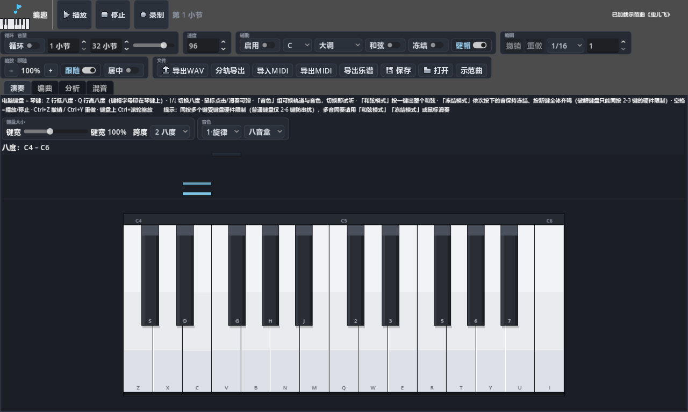

<div align="center">

# 编趣 BianQu

**纯电脑键盘弹奏 + 鼠标点击编曲的桌面端纯音乐工具**

不需要 MIDI 键盘，不需要乐理基础 —— 打开就能弹，弹完就能存，存完就能导出给游戏引擎用。

[](LICENSE)


[中文](README.md) · [English](README.en.md)



</div>

---

## 这是什么

给三类人做的音乐工具：

| 你是 | 你能得到 |
|---|---|
| 🎮 小型游戏开发者 | 零延迟试听的编曲台 + 一键导出 WAV，直接扔进游戏引擎 |
| 🔊 音效制作者 | 芯片/柔弦/贝斯等合成音色，快速出 BGM 与音效小样 |
| 🎹 音乐新手 / 娱乐玩家 | 电脑键盘就是钢琴，调外键变暗、一键出和弦，弹不出错音 |

**明确不做**：歌词、演唱、外接 MIDI 设备、专业混音台。纯器乐，轻量上手。

## 特性

### 🎹 演奏模式
- 电脑键盘 = 琴键（两行式布局，键帽字母直接印在屏幕琴键上）
- **调性辅助**：选调 + 音阶后，调外键自动变暗，新手不易弹错
- **和弦模式**：按一个键自动补齐调内三和弦
- **回声条动效**：弹过的音在键盘上方化作升起的色块，按住越长块越高
- **键盘大小随意调**：键宽滑杆（60%–160%）/ 1–4 八度跨度 / 键盘上 Ctrl+滚轮缩放
- 音符记录回声条 + 按压下沉动画

### 🎼 编曲模式
- 钢琴卷帘：左键画音符拖长度 / 拖动移位 / 右键删除，网格吸附 1/16–整小节
- **录制**：演奏模式弹什么，自动量化落进卷帘
- 双轨 + 幽灵音符（另一轨半透明显示，对位写作不抓瞎）
- **布局区域可调**：卷帘与底部迷你弹奏键盘之间的分隔条随意拖动
- 缩放（`=` / `-` / Ctrl+滚轮）、跟随播放头、迷你琴键列点击试听
- 调性辅助同演奏页共享：卷帘中调外行整行变暗

### 📊 分析页
- 一键体检当前工程：音符数 / 曲长 / 音域 / 密度 / 力度 / 最大同时音 / 分轨统计
- **调性检测**（Krumhansl-Schmuckler 算法），可一键"应用到调性辅助"
- 音级分布直方图：时长×力度加权，调内音级高亮

### 🔊 音源（纯合成，安装包零采样体积）
| 音色 | 合成方式 | 适合 |
|---|---|---|
| 钢琴 | 6 次谐波加法合成 + 微失谐 + 锤击瞬态 | 主旋律 |
| 芯片 | 25% 占空比方波两段衰减 | 游戏音效 / BGM |
| 柔弦 | 正弦对 ±0.3% 失谐慢起音 | 铺底和弦 |
| 贝斯 | 正弦 + 二/三次谐波 | 低音 |

启动时后台线程合成并落盘缓存（二次启动秒开），播放期纯采样回放，零实时 DSP。

### 💾 文件
- 工程文件 `.bsong`：zstd 压缩二进制 —— 78 音符示范曲仅 **308 字节**
- **导出 WAV**：整曲实时总线录制，游戏引擎直接可用
- 关窗自动保存，下次启动自动恢复

## 快速开始

> 不想配环境？直接在 [Releases](https://github.com/fanquanpp/bianqu/releases) 下载 Windows 测试版（单文件免安装）。

1. 安装 [Godot 4.7+](https://godotengine.org/download)（标准版即可，无需 .NET）
2. 克隆本仓库，用 Godot 打开 `project.godot`
3. 按 F5 运行 —— 首次启动自带《小星星》示范曲

### 弹奏键位

```
高八度  Q 2 W 3 E   R 5 T 6 Y 7 U   I 9 O 0 P
        │ │ │ │ │   │ │ │ │ │ ││   │ │ │ │ │
低八度  Z S X D C V G B H N J M , L . ; /
        └白└黑└白└黑└白┘ └白└黑└白└黑└白┘
```

| 按键 | 功能 |
|---|---|
| `Z` 行 / `Q` 行 | 低 / 高八度琴键（黑键在错落位） |
| `↑` / `↓` | 整体升降八度 |
| `空格` | 播放 / 停止 |
| `=` / `-` | 编曲卷帘放大 / 缩小 |
| `Ctrl+滚轮`（键盘上） | 演奏键盘整体缩放 |

鼠标同样可弹：点击琴键发声，按住滑动可滑奏。

### 编曲鼠标操作

| 操作 | 效果 |
|---|---|
| 左键点空白 + 横向拖 | 新建音符并定长度 |
| 左键拖已有音符 | 移动（音高 + 时间） |
| 抓住音符右缘拖 | 改长度 |
| 右键 | 删除（按住扫删） |
| 滚轮 / Shift+滚轮 / Ctrl+滚轮 | 音高 / 时间 / 缩放 |
| 点击顶部标尺 | 跳转播放位置 |

### 可选：TypeScript 乐理后端（gode）

乐理计算（音阶/和弦）有双后端：默认 **GDScript** 即可完整运行；安装 [gode](https://github.com/godothub/gode)（godothub 的 Godot TS 语言插件）后自动切换 TypeScript 后端：

> 该插件体积大（全量安装约 234MB），仓库已通过 [.gitignore](.gitignore) 的 `/addons/gode/` 规则**整体排除**——克隆仓库不会包含它，也不要把它提交进仓库。未安装时项目照常运行（乐理自动回退 GDScript，功能完全一致）。

1. 从 [gode Releases](https://github.com/godothub/gode/releases) 下载 `gode.zip`
2. 解压出 `gode` 文件夹放入项目 `addons/` 目录（只保留你所用平台的 `binary/` 即可）
3. 用 Godot 打开项目 → 项目设置 → 插件 → 勾选启用 → 重启编辑器

启动日志出现 `[Theory] 乐理引擎后端: gode-typescript` 即生效；未安装时显示 `gdscript`，功能完全一致。

> **维护者注意**：启用 gode 后，编辑器会自动往本地 `project.godot` 写入 `EventLoop` autoload 与 `[native_extensions]` 两处配置。这两处指向被忽略的插件文件，**提交前须剥离**（仓库版不含它们，否则无插件的环境启动会报错）；提交后在本地恢复即可。

## 架构一瞥

```
键盘 / 鼠标 / 卷帘
      │
  MainUI（事件路由 · 分组工具栏 · 文件）
      │                    │
 Synth 播放引擎          Transport 走带
 播放器池×32+Limiter     事件调度 · 循环 · 录制时钟
      │                    │
 InstrumentBank          SongModel
 预渲染采样+zstd缓存     .bsong 读写 · 双轨数据
                           │
      Theory 乐理引擎（TS 优先 / GDScript 回退）
```

- **性能**：预渲染采样而非实时 DSP，播放期零热循环；卷帘/键盘/回声条均为单 Control 矢量绘制 + 脏刷新 + 视口裁剪
- **存储**：`.bsong` zstd 二进制（千音符 < 10KB）；采样磁盘缓存；无外部音频文件
- 完整设计文档（需求分析 / 音频引擎 / 语言选型 / 插件分工 / 验证记录）见 [DESIGN.md](DESIGN.md)

## godothub 生态插件分工

| 插件 | 状态 | 用途 |
|---|---|---|
| [Gode](https://github.com/godothub/gode) | ✅ 已接入 | TypeScript 乐理引擎（可选，自动回退） |
| [Godot-ECS](https://github.com/godothub/godot-ecs) | ⏳ v0.2 | 鼓机步进轨 / 多轨并行事件调度 |
| [Compute-Flow](https://github.com/godothub/compute-flow) | ⏳ v0.3 | GPU 实时效果器（混响/均衡）候选 |
| [Gmui](https://github.com/godothub/gmui) | ⏳ 预留 | 设置页 / 新手引导等表单页 |
| [Konado](https://github.com/godothub/konado) | ❌ 不适用 | 视觉小说框架，与纯音乐工具无关 |

## 项目结构

```
├── DESIGN.md              # 设计文档（功能/架构/选型/验证）
├── scenes/main.tscn       # 入口场景
├── scripts/               # GDScript（UI/音频/数据/走带/分析）
│   ├── theory.ts          # TypeScript 乐理引擎（gode 后端）
│   └── ui/                # 演奏键盘 / 钢琴卷帘 / 回声条 / 分析面板 / 主界面
├── aseprite/              # Aseprite 像素画源文件
├── assets/sprites/        # 导出的 PNG（logo/图标集/应用图标）
└── docs/screenshots/      # 界面截图
```

## 路线图

- [x] v0.1 演奏 / 双轨卷帘 / 录制量化 / 4 音色 / 存取 / WAV 导出 / gode 混合语言
- [x] v0.1.2 回声条动效 / 缩放 / 分组工具栏 / 图标重绘
- [x] v0.1.3 编曲播放发声修复 / 分析页（统计+调性检测）/ 键盘大小调节 / 卷帘-键盘区域可调 / 绘制质量（描边+抗锯齿+像素对齐）
- [ ] v0.2 撤销重做 · 鼓机步进轨 · MIDI 导入导出 · 自动和声建议
- [ ] v0.3 SF2/SFZ 采样音源 · GPU 效果器 · 工程模板

## 协议

[MIT](LICENSE) © 2026 fanquanpp

## 致谢

- [Godot Engine](https://godotengine.org) · [godothub/gode](https://github.com/godothub/gode)
- 设计参考：[FL Studio Piano Roll](https://www.image-line.com/fl-studio-learning/fl-studio-online-manual/html/pianoroll.htm)（调性高亮/和弦戳/幽灵音符）、[Ableton](https://www.ableton.com/en/manual/arrangement-view/)（编曲视图）、[Synthesia](https://synthesiagame.com/) / [SeeMusic](https://www.seemusicapp.com/) / [notefall](https://github.com/ekkx/notefall)（音符可视化）
